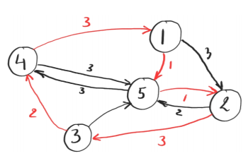
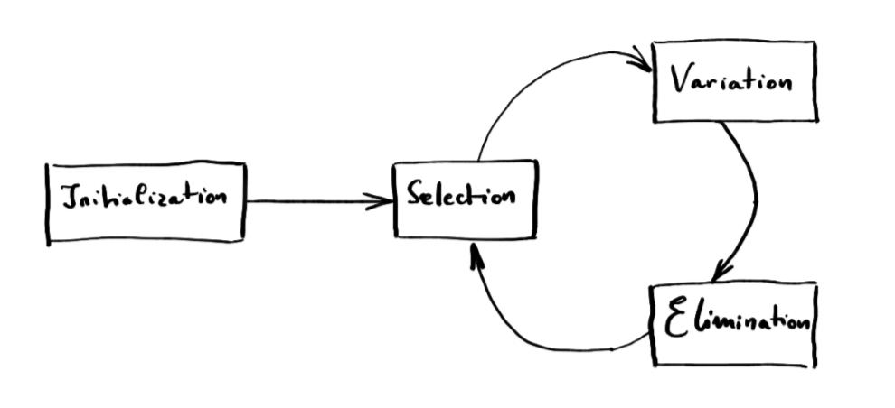

# Project-TSP
## Problem statement
The traveling salesperson problem consists of minimizing the length of a cycle that visits all vertices in a
weighted, directed graph. The length of a cycle is defined as the sum of the weights of all directed edges constituting the cycle. For example, the cycle defined by the red edges in the figure below has length 10:
 
 

  
 
  

Hence, the optimization problem involves visiting all vertices, while keeping the length to a minimum. The goal of this project is to solve this optimization problem using an evolutionary algorithm: 

 
 

